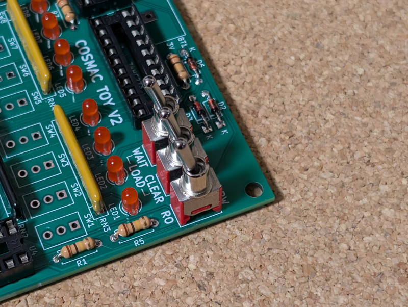

# COSMAC TOY V2 組み立て手順例

COSMAC TOY V2の組み立て手順例です。  
基本的には部品の高さが低いものからはんだ付けするとぐらぐらせずに作業しやすいです。  
トグルスイッチの取り付けがやや難しいかもしれません。ゆっくり位置を合わせてください。

- [回路図](/schematics/cosmac_toy_v2-rev03-sch.pdf)
- [部品表](/bom/cosmac_toy_v2-rev03-bom.csv)

1. 基板の目視確認  
基板をじっくり観察し、配線パターンに大きな傷がないかなど表面、裏面を確認してください。
1. ダイオードの取り付け  
ダイオードをはんだ付けします。極性があるので向きを間違えないようにしてください。
 
1. 抵抗の取り付け  
抵抗をはんだ付けします。向きを合わせておくときれいに見えます。
 
1. USB-C電源コネクタの取り付け  
USB-C電源コネクタを使う場合はここではんだ付けしておきます。

1. 丸ピンICソケットの取り付け  
丸ピンICソケットをはんだ付けします。向きに注意してください。シルクの切り欠きとソケットの切り欠きを合わせてください。

1. 平ピンICソケットの取り付け  
平ピンICソケットをはんだ付けします。向きに注意してください。シルクの切り欠きとソケットの切り欠きを合わせてください。

1. パーツの高さの確認  
集合抵抗、LED、スライドスイッチの高さを確認して低いものから取り付けていきます。この例ではLED→集合抵抗→スライドスイッチで取り付けてみます。  
 
1. LEDの取り付け  
極性がありますので注意してください。短い足がカソードですので、Kのマークに合わせてはんだ付けしてください。 

1. 集合抵抗の取り付け  
集合抵抗は向きがあります。パッケージに共通ピンを示す点が書かれていますので、基板のシルクの共通ピンに合わせてください。  

1. スライドスイッチの取り付け  
スライドスイッチをはんだ付けします。

1. トグルスイッチの向きを同じにしておく  
トグルスイッチをはんだ付けする前にスイッチの向きを合わせておきます。この例では写真のように定格が書かれている面を見えるようにして、スイッチを下向きに合わせておきます。向きを合わせておくと実装後にきれいに見えます。

1. トグルスイッチの仮止め  
まずは右上の３つのトグルスイッチを取り付けます。写真のように取り付けていきます。ここで１つのピンだけはんだ付けして仮止めしておきます。  

1. トグルスイッチの位置の調整  
仮止めの状態では斜めに取り付けられていることが多いので、正しい位置になるように縦、横から見ながら仮止めしている箇所にはんだコテを当てながらトグルスイッチの位置を調整します。基板面とトグルスイッチの底面がぴったり接触するように上から軽く押し付けるようにしてみてください。  
 
1. 残りのトグルスイッチの仮止め  
残り２つのトグルスイッチも１つのピンだけはんだ付けして同様に仮止めし、位置を合わせます。  

1. トグルスイッチの固定  
３つのトグルスイッチの位置が確定したら、３つのピンをはんだ付けして完全に固定します。力がかかる部分ですのでしっかりはんだ付けしてください。  
  
電池ボックスを使用する場合はここではんだ付けしてください。 
1. データ入力用トグルスイッチの仮止め  
先ほどのトグルスイッチの取り付け方法と同じように取り付けていきます。基板がぐらぐらしないように両端から仮止めすると良いです。  
 
1. データ入力用トグルスイッチの固定  
８つのトグルスイッチの位置が決まったら、３つのピンをはんだ付けして完全に固定します。力がかかる部分ですのでしっかりはんだ付けしてください。  
 
1. コンデンサのとりつけ  
コンデンサを取り付けます。C1は22P、C2は0.1μF(104)をはんだ付けしてください。
 
1. プッシュスイッチの取り付け  
プッシュスイッチは取り付け枠がありますので、正しい位置に固定しやすいです。１ピンだけ仮止めをして問題なければ残りのピンをはんだ付けして固定してください。
 
1. DCジャックの取り付け  
DCジャックを使用する場合はここではんだ付けしてください。
 
1. 実装ミスがないかを確認  
以下の点を確認してください。   
    - [ ] 部品面：部品の取り付け忘れがないか。
    - [ ] 部品面：CPU、ロジックIC、ダイオード等の向きは正しいか
    - [ ] 部品面：抵抗の値、コンデンサの値、集合抵抗の値は正しいか  
    - [ ] はんだ面：はんだ付けを忘れているところはないか
    - [ ] はんだ面：はんだでブリッジしているところはないか  
1. 電源ラインの確認  
DCジャックまたはUSB-C電源を接続し、CPUやロジックICの電源ピンに正しく5V電源が供給されているかをテスターで確認することをおすすめします。
1. CPUとロジックICの取り付け  
CPUとロジックICを取り付けます。型番と切り欠きの向きを正しく合わせ、ピンが曲がらないように慎重に取り付けてください。

1. 動作確認  
DCジャックもしくはUSB-C電源を接続し、動作確認を行います。電源を投入したら変な臭いがしないか、熱くなっているCPUやICが無いかを指で触って確認します。異常があった場合はすぐ電源を切り、実装の再確認を行ってください。  
問題がなさそうであれば、サンプルプログラム [01_osc1](/programs/01_osc1/README.md)の４バイトのプログラムをトグルスイッチで入力し、実行してみてください。Q-LEDが点灯すれば正しく動作しています。お疲れさまでした。 
 
