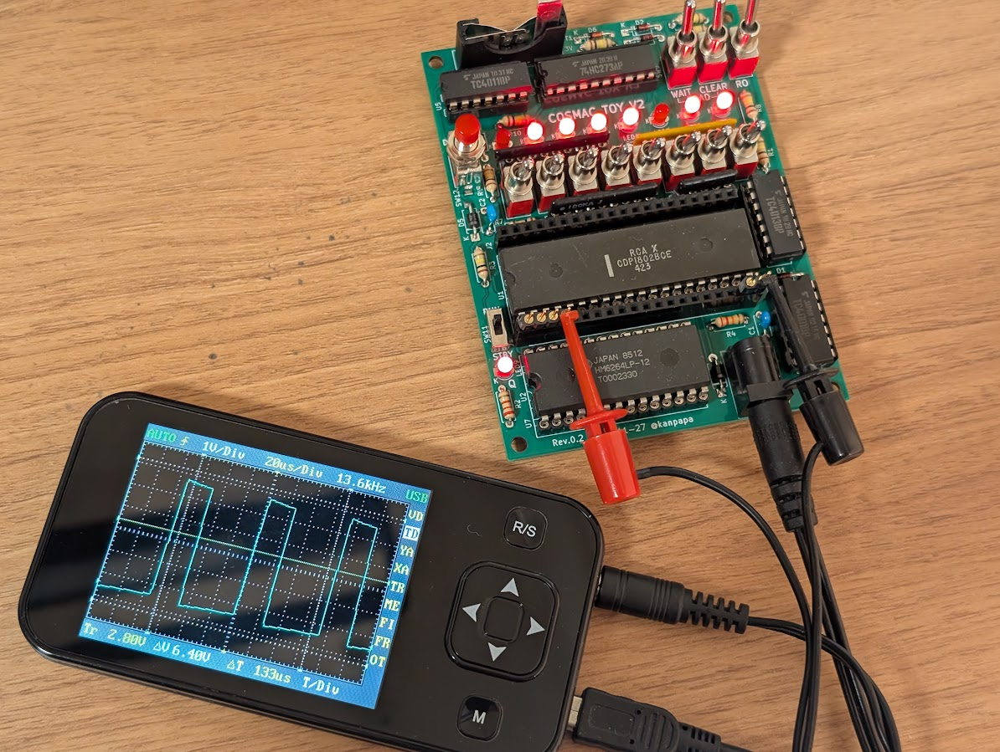

# パルス信号を作る

## 概要
動作確認用として4バイトのシンプルなプログラムを動かします。CDP1802にはQという端子があり簡単な命令で0/1を出力することができます。

## サンプルプログラム

```
0000-7B        START   SEQ             ;Q <- 1
0001-7A                REQ             ;Q <- 0
0002-30 00             BR      START   ;Branch to START
```

## 実行結果
このプログラムを実行するとQ LEDが点灯します。Q端子にオシロスコープを接続すればパルス出力が確認できます。

