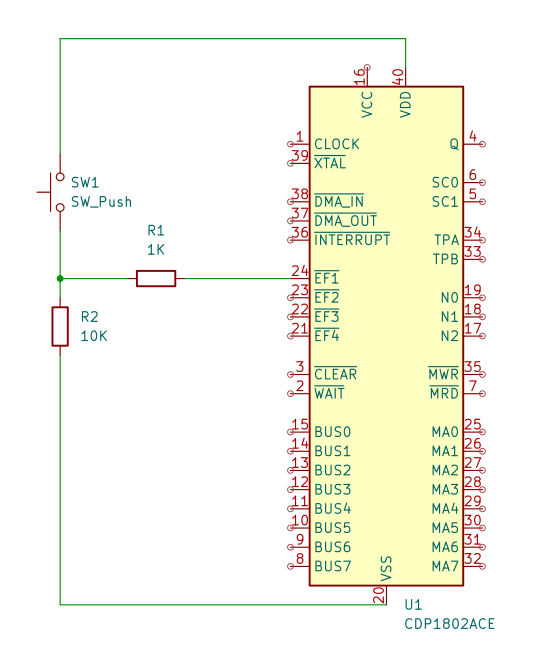

# 押しボタンスイッチでQ出力を制御

## 概要
EF1～EF4（4フラグ）の使用例です。  
EF1～EF4入力により、外部機器からのステータス情報をプロセッサに転送できます。
これらの入力レベルは、条件分岐命令でテストできます。

ここではEF1端子に押しボタンスイッチを接続し、スイッチを押した場合はEF1端子がHIGH、押していないときはEF1端子がLOWとなるようにしています。

## 使用する命令

|INSTRUCTION|MNEMONIC|OP CODE|OPERATION|
|---|---|---|---|
|SHORT BRANCH IF EF1 = 1 (EF1 = VSS)|B1|34|IF EF1 = 1, M(R(P)) → R(P).0, ELSE R(P) + 1 → R(P)|
|SHORT BRANCH IF EF1 = 0 (EF1 = VCC)|BN1|3C|IF EF1 = 0, M(R(P)) → R(P).0, ELSE R(P) + 1 → R(P)|

## コード

```
0000-34 05    START:  B1      L1                  ; ~EF1 = 1(VSS) だったら L1にジャンプ
0002-7A               REQ                         ; Q出力を0にする(LED消灯)
0003-30 00            BR      START               ; 0000番地にジャンプ
0005-7B       L1:     SEQ                         ; Q出力を1にする(LED点灯)
0006-30 00            BR      START               ; 0000番地にジャンプ
```

## 回路図



