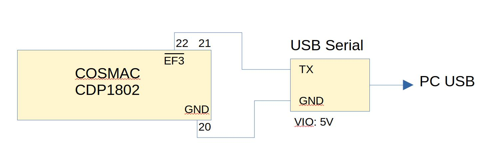
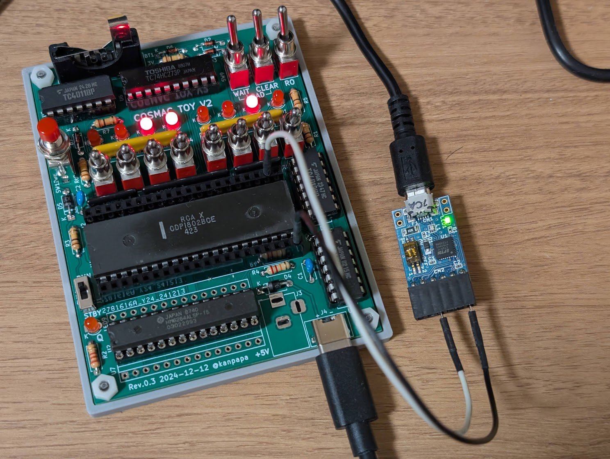
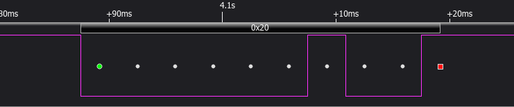

# Serial Binary loader for COSMAC TOY V2

[プログラム05 押しボタンスイッチ](/programs/05_sw1/README.md)ではEF1端子の入力信号を読み取ってQ-LEDを点灯させました。  
これを応用してシリアルデータ信号をEF端子に入力することで、データ転送ができるのではないでしょうか。  
実際にそのような使いかたを行って、シリアル通信を使ってバイナリデータをメモリにロードすることができます。

オリジナルは1802 MemberShip Card用のプログラムですが、これをCOSMAC TOY V2でも動作するように修正しました。

* 参考サイト
    [Serial Binary loader for 1802 Membership Card](https://www.retrotechnology.com/memship/mship_binloader.html)
* 参考ソース
    [Here's Jonathan Mordosky's original binary loader code](https://www.retrotechnology.com/memship/binldr_m.asm)

## 回路図

COSMAC TOY V2とUSBシリアル変換モジュールを接続しPCと接続します。IOの電圧は5Vのものを使用してください。  
私は秋月電子の[FT-232RQ USBシリアル変換モジュール](https://akizukidenshi.com/catalog/g/g111007/)を使用しました。



実際にUSBシリアル変換モジュールに接続している様子です。



## 実際のシリアル信号

上記の回路図でEF3端子にどのような信号が流れるのかをロジックアナライザで確認しました。このシリアルデータはスペースコード(0x20)です。



最初の緑色の点がスタートビットです。  
その後、データの下位ビットから上位ビットに向けてデータのビットが８個並びます。  
最後の赤色の点がストップビットです。  
プログラムではこの信号をEF3端子で読み取って、ソフトウェアでシリアルデータをデコードしてメモリにストアします。

## ソースコード

修正したソースコードのアセンブル結果は以下のようになります。シリアル信号を見ながら追ってみてください。  
COSMAC TOY V2用に修正した箇所は以下の通りです。
- メモリが0000-00FFまでしか使えないのでロードアドレスは0040-としました。
- オリジナルのソースコードでは信号が反転していたので、EF3のチェック部分を反転しました。（B3をBN3に、BN3をB3に入れ替えています。）

最初にスペースコードを入力することで、1ビットの時間をカウントしています。このカウント値を使用したタイミングで読み取ることでシリアルデータのビットに追従します。COSMAC TOY V2はクロックが400KHzなので高速通信は難しいですが、300bpsは問題なく動作しました。

※ソースコードは暫定版です。コメントなど整理した上で更新予定です。
```
SB-Cross Assembler version 3.03.10
Please visit www.sbprojects.net for a complete description.

Assembling....

Pass one
Loaded 1802 overlay version 3.01.01

Pass two
0000-                  1        ; 1802 Membership Card .bin loader by Jonathan Mordosky
0000-                  2        ; Edited by Lee Hart Oct 29 2015, JOnathan Mordosky Nov 3 2015
0000-                  3        ;
0000-                  4        ; first, here is the original by Jonathan Mordosky in cosmacelf Oct 2015
0000-                  5        ; Loads binary file starting at address XX00, Where XX is any page in memory above 00
0000-                  6        ; For 1802 Membership Card, serial port configured as Normal (not inverting)
0000-                  7        ; Tested at 300 baud 8N1. Should work at slightly higher baud rates
0000-                  8        ;
0000-                  9        ; To Use: Toggle in program as usual.
0000-                 10        ; Start up and configure communications program on host computer.
0000-                 11        ; On 1802MC, make sure write protect is off. Flip switch to Clear, then Run.
0000-                 12        ; Hit <Space> exactly once on host computer, watching that the output LEDs do not change.
0000-                 13        ; On newer revision boards, the green LED will blink as the space character is received.
0000-                 14        ; Send BIN file as ASCII from host computer. Make sure program settings don't strip the 8th bit.
0000-                 15        ; Output LEDs should now change and show the data as it is received.
0000-                 16        ;
0000-                 17        ; When blinking stops, verify that the LEDs match the last byte of the program.
0000-                 18        ; Toggle in a long jump instruction to start of program (0xC0 0xXX 0x00) and run.
0000-                 19        ; If unsuccessful, check com settings and try again.
0000-                 20
0000-                 21        ; Binary loader for COSMAC TOY V2 by Kazuhiro Ouchi
0000-                 22        ; Edited by Kazuhiro Ouchi Dec 31 2024
0000-                 23        ; This source program can be assembled with the SB assembler.
0000-                 24
0000-                 25        ; hex listing for COSMAC TOY V2
0000-                 26
0000-                 27        ;0000   F8 00 B2 F8 40 A2 E2 F8
0000-                 28        ;0008   00 3E 09 36 0B FC 01 3E
0000-                 29        ;0010   0D FF 04 B3 36 14 F8 09
0000-                 30        ;0018   A3 3E 19 93 F6 38 93 FF
0000-                 31        ;0020   01 3A 1F 02 F6 36 29 F9
0000-                 32        ;0028   80 52 23 83 3A 1E 61 30
0000-                 33        ;0030   14
0000-                 34
0000-                 35                .CR 1802
0000-                 36                .OR 0000H       ;initialization　　　　　　　　 初期化
0000-                 37        Page    .eq     00      ; desired page destination      バイナリをロードするページ先。COSMAC TOYは256byteメモリなので00で良い
0000-                 38        ;
0000-F8 00            39 (   2)         LDI Page        ;Set destination starting address   デスティネーション開始アドレスの設定
0002-B2               40 (   2)         PHI 2           ;R2 points to destination           R2 はデスティネーションを指す。
0003-                 41        ;       GHI 0           ;  LSB of destination is 00
0003-F8 40            42 (   2)         LDI $40         ;  LSB of destination is 40  COSMAC TOYの場合はデスティネーションの下位バイトは40とする。
0005-A2               43 (   2)         PLO 2           ;  (assumes this program is at 00XX)  ロードするプログラムは00XXにあると仮定する。
0006-E2               44 (   2)         SEX 2
0007-F8 00            45 (   2)         LDI 0           ; Dレジスタを$40にしてしまったので0を設定しておく。(Timeで使うから)
0009-                 46
0009-3E 09            47 (   2) LoopA   BN3 LoopA       ;スタートビットを待つ。EF3がHIGHの場合はループ。B3がLOWになったら次のステップへ
000B-                 48
000B-36 0B            49 (   2) LoopB   B3 LoopB        ;ASCIIコードのスペースのD5=1のデータビット(EF3がHIGH)を待つ。（データはLSBファーストで送信される）
000D-                 50                                                ;time Data bit D5
000D-                 51                                                ;  Dレジスタは0に初期化済
000D-FC 01            52 (   2) Time    ADI 1           ;  D=D+1 for each loop   Dを1加算するループ
000F-3E 0D            53 (   2)         BN3 Time        ;  ...until end of bit   データビット終了(EF3=LOWになる)までループで加算し続ける。データビットが終了したら次のステップへ
0011-                 54                                        ;each loop is 2 instructions,
0011-                 55                                        ;so Delay x 2 = number of instructions per bit
0011-FF 04            56 (   2)         SMI 4           ;Subtract 4 extra instructions
0013-B3               57 (   2)         PHI 3           ;Store Delay Constant in R3.1
0014-                 58
0014-                 59        ;       so (Delay+4) x 2 = # of instructions in one bit time
0014-                 60
0014-                 61                                                ;OK, we're ready to receive data
0014-36 14            62 (   2) Main    B3 Main         ;ストップビット(EF3=HIGH)を待つ
0016-F8 09            63 (   2)         LDI 9           ;R3.0 = #bits = 9
0018-A3               64 (   2)         PLO 3
0019-3E 19            65 (   2) LoopC   BN3 LoopC       ;スタートビット(EF3=LOW)を待つ
001B-93               66 (   2)         GHI 3           ;Delay 1/2 bit time
001C-F6               67 (   2)         SHR             ;  to move to middle of bit
001D-38               68 (   2)         SKP             ;
001E-93               69 (   2) NextBit GHI 3           ;Delay one bit time
001F-                 70
001F-FF 01            71 (   2) Delay   SMI 001H
0021-3A 1F            72 (   2)         BNZ Delay
0023-                 73
0023-02               74 (   2)         LDN 2           ;Get bits received so far...
0024-F6               75 (   2)         SHR                 ;  Shift right, and set most.sig.bit=0
0025-36 29            76 (   2)         B3 Zero             ;  if serial input=1 (i.e. EF3 pin is low)　シリアルデータビットが0（EF3がLow）の場合は分岐する
0027-F9 80            77 (   2)         ORI 080H        ;    then set most.sig.bit=1 シリアルデータビットが1の場合はORでビットを立てる
0029-52               78 (   2) Zero    STR 2           ;Store Data  R2は転送先アドレスを指す。そこにデータをストアする
002A-23               79 (   2)         DEC 3           ;Count out bits　処理したビットをカウント
002B-83               80 (   2)         GLO 3
002C-3A 1E            81 (   2)         BNZ NextBit     ;Loop until byte Finished
002E-                 82        ;       OUT 4           ;Show Data and INC Pointer
002E-61               83 (   2)         OUT 1           ;受信したデータをLEDに表示。COSMAC TOY V2の場合はOUT1なので変更しました。
002F-30 14            84 (   2)         BR  Main        ;Get next byte
0031-                 85
0031-                 86                .EN

0 Errors found during assembly.
0 Warnings found during assembly.
```

## 実行方法
1. 以下のシリアルローダープログラムをトグルスイッチで入力します。49バイトですので頑張って入力しましょう。
    ```
    0000   F8 00 B2 F8 40 A2 E2 F8
    0008   00 3E 09 36 0B FC 01 3E
    0010   0D FF 04 B3 36 14 F8 09
    0018   A3 3E 19 93 F6 38 93 FF
    0020   01 3A 1F 02 F6 36 29 F9
    0028   80 52 23 83 3A 1E 61 30
    0030   14
    ```
1. USBシリアル変換モジュールをCOSMAC TOY V2に接続します。
1. リセットしてシリアルローダープログラムを実行します。メモリは書き込み可能な状態にしてください。
1. PCでシリアルターミナルを起動します。通信速度は300bpsで、データ形式は8N1（データ8ビット、ストップ１ビット、パリティ無し）に設定してください。
1. シリアルターミナルから最初にスペースキーを１回押下します。これでプログラムが通信速度を設定します。
1. その後バイナリデータをPCのシリアルターミナルから送信すると、その内容が0040以降に書き込まれます。
1. バイナリデータを送信し終わったら、最後のデータの内容とLEDの表示が一致しているはずです。ここでプログラムを停止してください。(WAITスイッチを上側に倒す)
1. メモリの書き込みを禁止して、LOADモードにして、0040以降にアップロードしたバイナリデータが書かれているかを確認してください。

バイナリデータの代わりに、キーボードから文字を入力すればそのASCIIコードが0040以降に書き込まれます。文字を入力するたびにLEDがその文字のASCIIコードに変化することが確認できます。

## 実行結果
PCのシリアルターミナルで数字のキーを押すとASCIIコードの0x30-0x39がLEDに表示されます。  
クリックすると動画が表示されます。  
[](https://www.youtube.com/watch?v=f7oefC-dY0M)

PCのシリアルターミナルで適当にキーボードを入力すると、入力した文字のASCIIコードがLEDに表示されます。  
クリックすると動画が表示されます。  
 [](https://www.youtube.com/watch?v=1_WPMiToYoo)